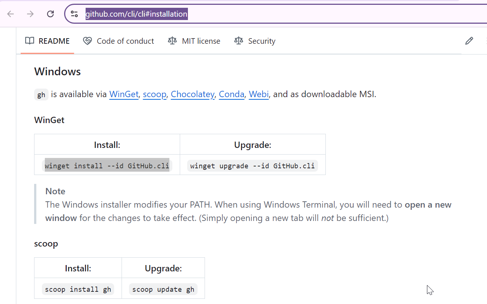
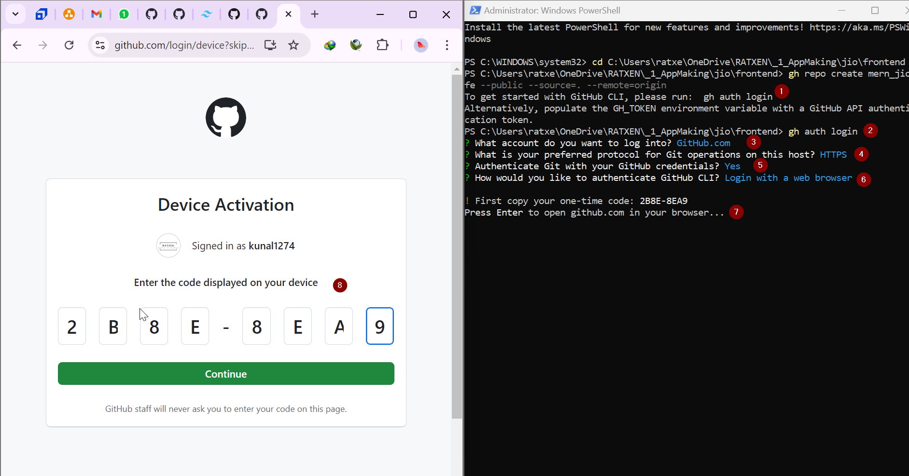
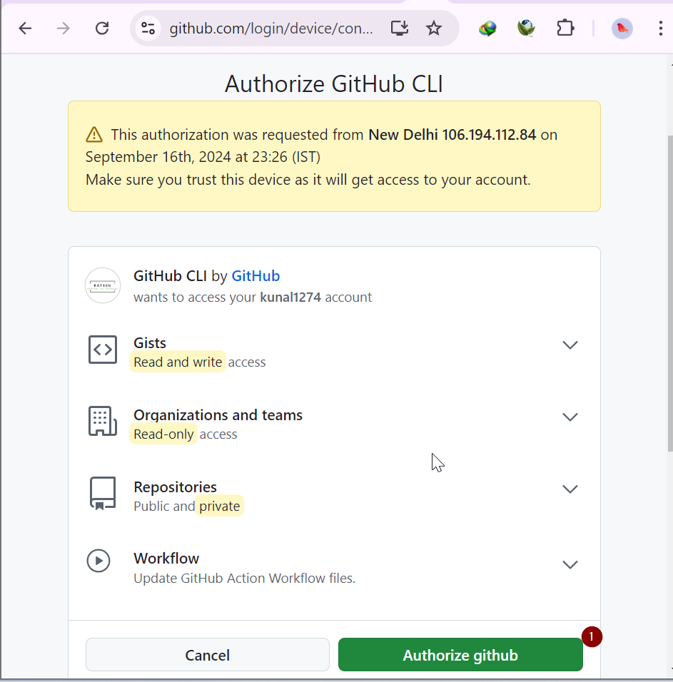
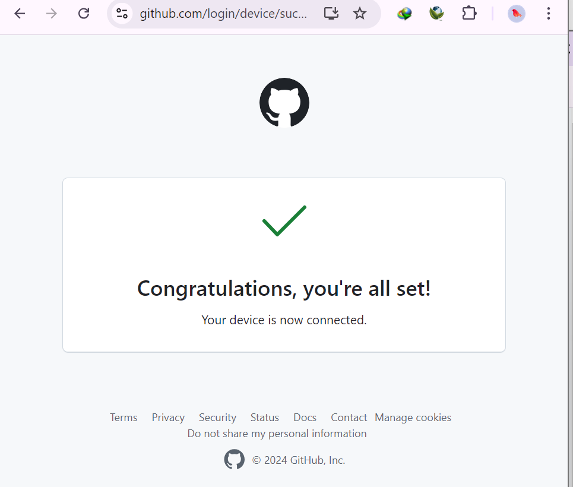
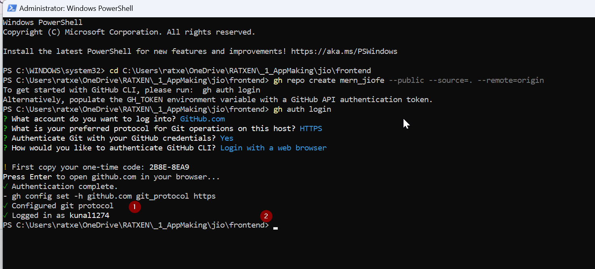
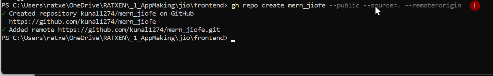
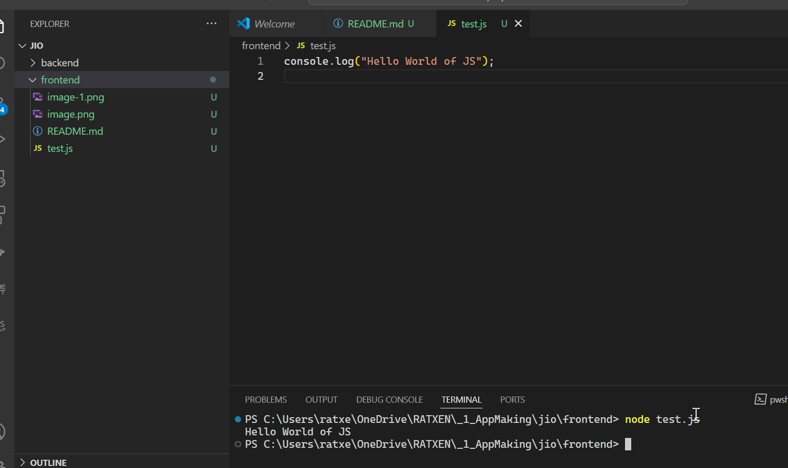
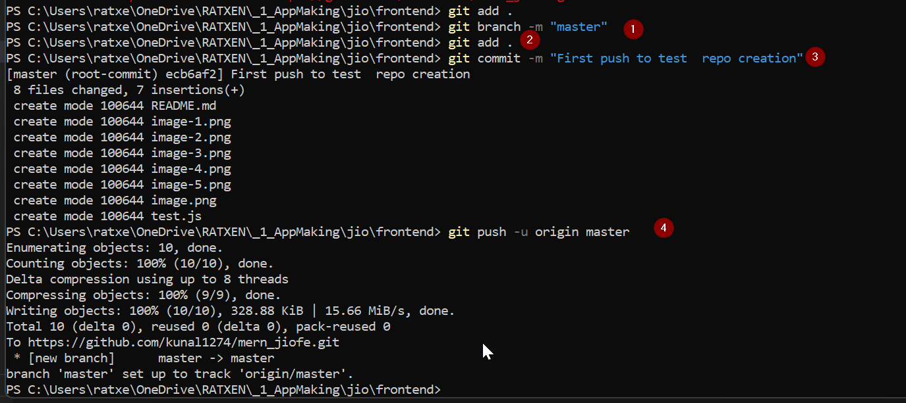
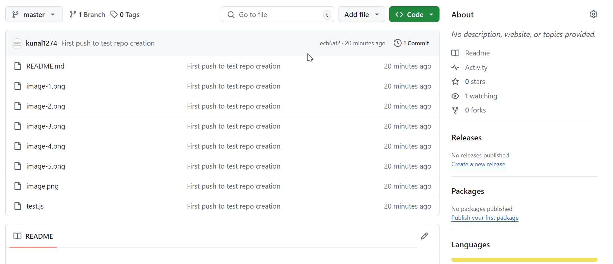
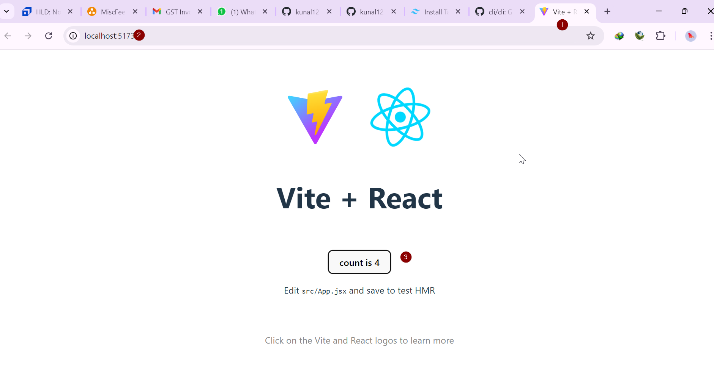

# React + Vite

This template provides a minimal setup to get React working in Vite with HMR and some ESLint rules.

Currently, two official plugins are available:

- [@vitejs/plugin-react](https://github.com/vitejs/vite-plugin-react/blob/main/packages/plugin-react/README.md) uses [Babel](https://babeljs.io/) for Fast Refresh
- [@vitejs/plugin-react-swc](https://github.com/vitejs/vite-plugin-react-swc) uses [SWC](https://swc.rs/) for Fast Refresh

### How to install the vite in the current directory :

```sh
npm create vite@latest ./ -- --template react
```

### How to install the latest vite in the new project directory :

```sh
npm create vite@latest my-project -- --template react
```

```sh
cd my-project
```

# How to create a remote repository and do the set up for git hub cli

link :
https://github.com/cli/cli#installation



- Now setting up the gh hub cli log in









- creating the remote git hub repo



test.js file which we will push to git hub as well.


- First push to git hub
  

  

### Lets work on the project

- To run the vite project.

```sh
npm run dev
```


