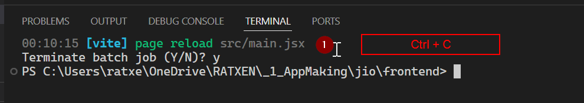
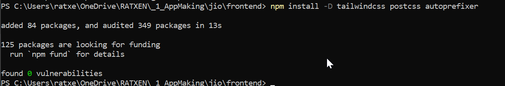
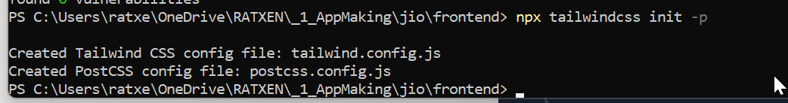
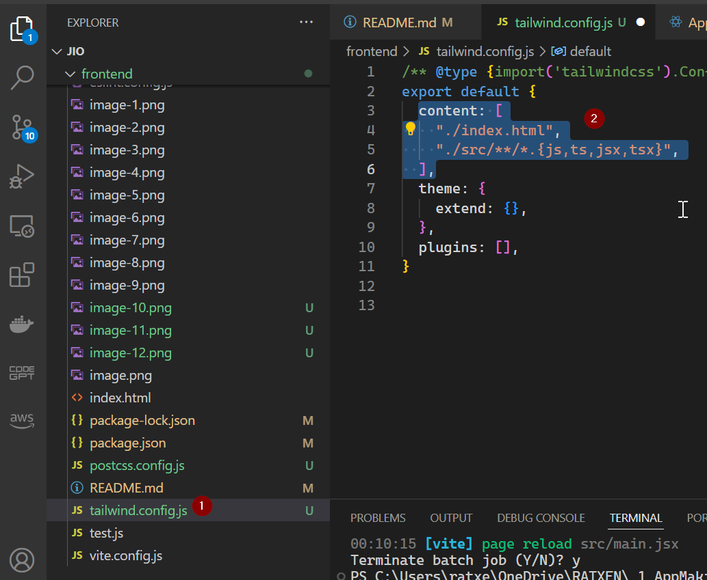
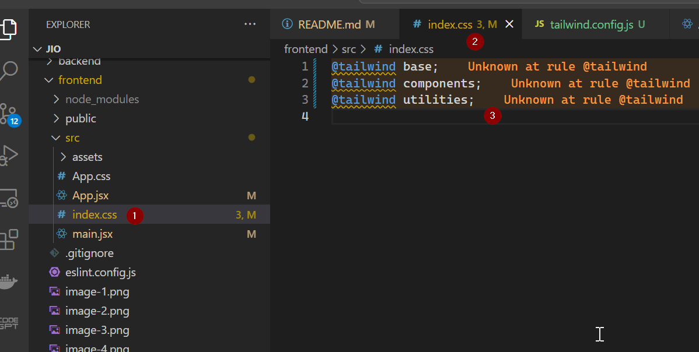
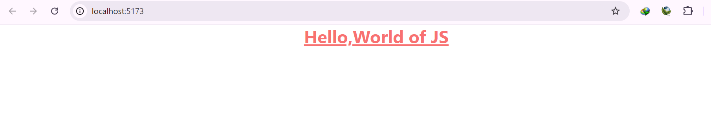

# React + Vite

This template provides a minimal setup to get React working in Vite with HMR and some ESLint rules.

Currently, two official plugins are available:

- [@vitejs/plugin-react](https://github.com/vitejs/vite-plugin-react/blob/main/packages/plugin-react/README.md) uses [Babel](https://babeljs.io/) for Fast Refresh
- [@vitejs/plugin-react-swc](https://github.com/vitejs/vite-plugin-react-swc) uses [SWC](https://swc.rs/) for Fast Refresh

### How to install the vite in the current directory :

```sh
npm create vite@latest ./ -- --template react
```

### How to install the latest vite in the new project directory :

```sh
npm create vite@latest my-project -- --template react
```

```sh
cd my-project
```

# How to create a remote repository and do the set up for git hub cli

link :
https://github.com/cli/cli#installation


- Now setting up the gh hub cli log in


- creating the remote git hub repo


test.js file which we will push to git hub as well.


- First push to git hub
  

  

### Lets work on the project

- To run the vite project.

```sh
npm run dev
```


#### How to install tailwind css

- First stop the server to start the installation process -
  

link : https://tailwindcss.com/docs/guides/vite

```sh
npm install -D tailwindcss postcss autoprefixer
```



```sh
npx tailwindcss init -p
```



- Change the tailwind.config.js

```javascript
/** @type {import('tailwindcss').Config} */
export default {
  content: ["./index.html", "./src/**/*.{js,ts,jsx,tsx}"],
  theme: {
    extend: {},
  },
  plugins: [],
};
```



- Add the tailwind directives to css

```css
@tailwind base;
@tailwind components;
@tailwind utilities;
```



- Do some changes for the app.jsx file to see if the tailwind is implemented or not

```javascript
function App() {
  return (
    <>
      <h1 className="text-3xl font-bold text-red-400 flex justify-center underline">
        Hello,World of JS
      </h1>
    </>
  );
}

export default App;
```

and main.jsx will look like below -

```javascript
import { StrictMode } from "react";
import { createRoot } from "react-dom/client";
import App from "./App.jsx";
import "./index.css";

createRoot(document.getElementById("root")).render(
  <StrictMode>
    <App />
  </StrictMode>
);
```

Now run the :

```sh
npm run dev
```

and it is working as expected -

